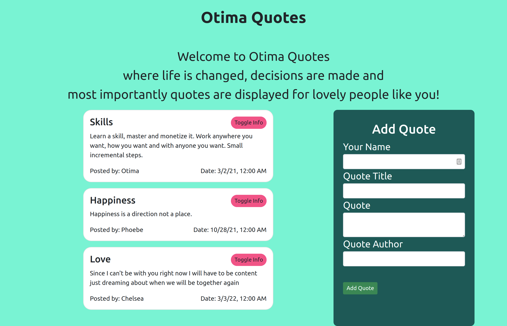

# Quotes
#### Quotes, April 10th 2021
#### By **Wayne Musungu**

## Description
- This an  application that enables users to add quotes, delete quotes, upvote quote and downvote quote. This application contains a form component that has input sections for the quote, the author, and the person who submitted the quote.

## Behaviour Driven Development(BDD)

| Input                        | Ouput                                                                                            |
|--------------------------    |----------------------------------------------------------------------------------------------    |
| User clicks Post  Quote     | Quote form displays with input fields for Author, Publisher                  |
| User Clicks Delete           | The quote is purged from view             |
| User clicks Upvote        |   upvote is incremented value by  1 on each click      |
| User clicks Downvote     | downvote is decremented value by 1 on each click     |

## Setup/Installation requirements

- Clone  or download and unzip the repository from github, [https://github.com/WayneMusungu/Quote-app.git].
- If you have git Use this command `git clone *` to clone the project.
- Run ng serve from your terminal

## Live Demo
To view the page click on the link below
* https://waynemusungu.github.io/Quote-app/

## Technologies Used
- Angular CLI

## Known Bugs
- There are no known bugs currently. The page works as expected.

## Support and Contact Details
- For any comments,suggestions, feedback or inquiries, contact me via email: `waynemuyera17@gmail.com`

- Make contributions to the code.

## License

*MIT*
Copyright (c) 2022 **Wayne Musungu**

Permission is hereby granted, free of charge, to any person obtaining a copy of this software and associated documentation files (the "Software"), to deal in the Software without restriction, including without limitation the rights to use, copy, modify, merge, publish, distribute, sublicense, and/or sell copies of the Software, and to permit persons to whom the Software is furnished to do so, subject to the following conditions:

The above copyright notice and this permission notice shall be included in all copies or substantial portions of the Software.

THE SOFTWARE IS PROVIDED "AS IS", WITHOUT WARRANTY OF ANY KIND, EXPRESS OR IMPLIED, INCLUDING BUT NOT LIMITED TO THE WARRANTIES OF MERCHANTABILITY, FITNESS FOR A PARTICULAR PURPOSE AND NONINFRINGEMENT. IN NO EVENT SHALL THE AUTHORS OR COPYRIGHT HOLDERS BE LIABLE FOR ANY CLAIM, DAMAGES OR OTHER LIABILITY, WHETHER IN AN ACTION OF CONTRACT, TORT OR OTHERWISE, ARISING FROM, OUT OF OR IN CONNECTION WITH THE SOFTWARE OR THE USE OR OTHER DEALINGS IN THE SOFTWARE.

=======
# Quote-app
